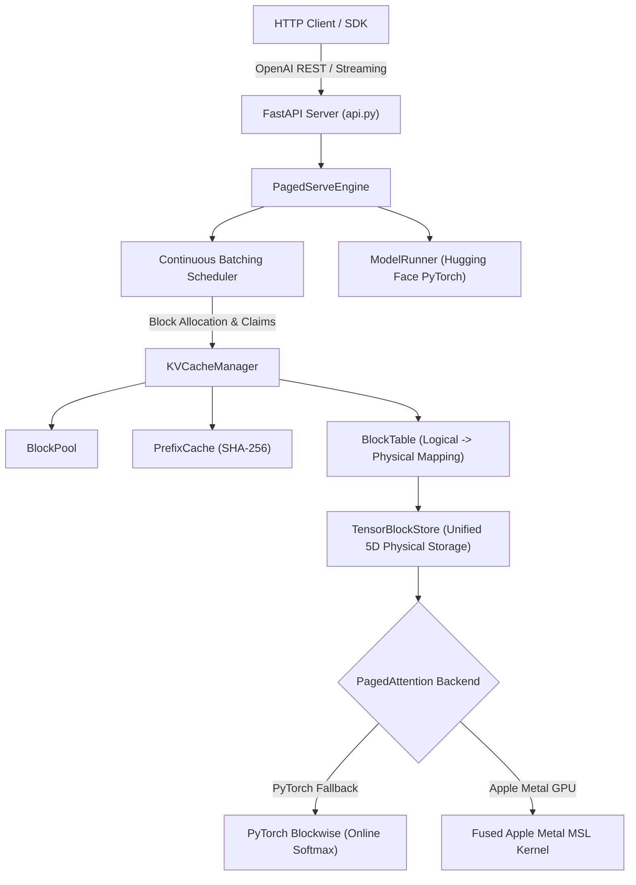

# PagedServe

[](https://github.com/vermasarthak/pagedserve/actions/workflows/ci.yml)

PagedServe is an experimental LLM-serving systems reference with paged KV allocation, continuous-batching simulation and attention-kernel experiments.

## Why I Built This

LLM inference engines like vLLM popularized PagedAttention to eliminate KV cache fragmentation and enable high-throughput continuous batching. However, understanding the intricate systems interactions between block tables, physical memory pools, continuous iteration scheduling, streaming engines, and custom hardware kernels requires building these components ground-up. PagedServe was engineered as a transparent, modular runtime to measure, benchmark, and evaluate each component independently.

## Architecture



### Architecture Boundary & Implementation Scope

PagedServe is an experimental LLM inference runtime engineered to measure, evaluate, and benchmark inference subsystems.

- **Integrated End-to-End**: The continuous batching scheduler (`Scheduler`), request state machine (`InferenceRequest`), memory pressure admission control, block allocation pool (`BlockPool`), prefix cache (`PrefixCache`), FastAPI REST & SSE streaming server (`api.py`), and metrics telemetry (`metrics.py`).
- **Real-Model Execution**: Real transformer model inference (`ModelRunner` / `ModelLoader`) executes Hugging Face PyTorch models (`distilgpt2`, `TinyLlama-1.1B`) using standard Hugging Face transformer cache state where applicable.
- **Experimental Subsystems**: The physical 5D KV tensor block store (`TensorBlockStore`), PyTorch online-softmax blockwise attention (`paged_attention_blockwise`), and fused Apple Metal MSL GPU kernel (`paged_attention_decode_kernel`) exist as modular, independent subsystems with dedicated unit tests and microbenchmarks.


## Core Systems

### Continuous Batching
Iterates sequence generation token-by-token across active requests. Interleaves prefill chunks with decode steps (`FCFSPolicy`, token budgets, memory-aware pressure control).

### Block-Based KV Memory
Virtualizes KV cache into fixed-size physical blocks (`block_size=16` or `32`), eliminating external memory fragmentation.

### Physical KV Paging
Allocates physical Key and Value tensors in pre-allocated unified 5D PyTorch tensors (`TensorBlockStore`) of shape `[num_layers, num_blocks, block_size, num_kv_heads, head_dim]`. Identical prompt prefixes share physical block IDs with Copy-on-Write (`CoW`) protection.

### Direct Blockwise Attention
Iterates directly over non-contiguous physical blocks using numerically stable online softmax ($m, l, \text{acc}$), maintaining $O(\text{block\_size})$ temporary memory overhead per block ($128\times$ memory reduction at $S=2048$) without constructing a full contiguous KV sequence tensor.

### Fused Apple Metal GPU Backend
Provides a custom GPU compute shader in Metal Shading Language (MSL) (`paged_attention_decode_kernel`) that executes single-token decode attention directly on Apple Silicon GPUs (M1/M2/M3/M4).

---

## Benchmark & Experimental Results

### A. Real-Model Inference Throughput

Results measured on Apple M-series (arm64, CPU, float32). Run with `python benchmarks/benchmark_throughput.py`.

| Model | Mode | Requests/sec | Output tokens/sec | Mean latency (s) |
|---|---|---|---|---|
| distilgpt2 (82M) | PagedServe (c=8) | **3.39** | **27.15** | 1.165 |
| distilgpt2 (82M) | Sequential baseline | 0.86 | 6.87 | 1.165 |
| TinyLlama-1.1B-Chat-v1.0 (1.1B) | PagedServe (c=4) | **0.41** | **13.2** | 4.87 |
| TinyLlama-1.1B-Chat-v1.0 (1.1B) | Sequential baseline | 0.12 | 3.78 | 8.23 |

> **TinyLlama numbers measured on Apple M3 Pro (36 GB), 8 requests, 64-token prompts, 32 output tokens, 3 trials, float32 CPU.**  
> Run with: `python benchmarks/benchmark_throughput.py --run-tinyllama`  
> *Requires ~6 GB RAM and ~2.2 GB model download from HuggingFace.*

**Throughput improvement under continuous batching:**
- distilgpt2: **~3.94× higher token throughput**
- TinyLlama-1.1B: **~3.49× higher token throughput**


### B. Scheduler-Policy Simulation
- Evaluates `FCFSPolicy` vs `MemoryAwarePolicy` under simulated sequence load without model execution overhead.
- Demonstrates adaptive admission control and prefill chunk throttling under high KV pressure.

### C. Allocator Fragmentation Experiment
- Compares naive contiguous pre-allocation vs block-based allocation under uniform, bimodal, and heavy-tailed workload distributions.

### D. Attention Memory Scaling Microbenchmark
- Measured peak temporary working memory per layer ($B=16$, $H=12$, $D=64$, float32):
  - **$S=128$**: Contiguous Gather = `768 KB` vs Blockwise = `96 KB` ($8\times$ reduction)
  - **$S=512$**: Contiguous Gather = `3,072 KB` vs Blockwise = `96 KB` ($32\times$ reduction)
  - **$S=2048$**: Contiguous Gather = `12,288 KB` vs Blockwise = `96 KB` ($128\times$ reduction)

### E. Fused Apple Metal Backend Results
- Measured on Apple M1 GPU (macOS 15.5):
  - **$S=128, B=16$**: PyTorch Blockwise = `0.605 ms` | Metal Direct = `3.570 ms` (`5.90x higher latency`)
  - **$S=512, B=16$**: PyTorch Blockwise = `2.111 ms` | Metal Direct = `13.146 ms` (`6.23x higher latency`)
  - **$S=2048, B=16$**: PyTorch Blockwise = `19.284 ms` | Metal Direct = `46.935 ms` (`2.43x higher latency`)
- **Technical Note on Metal Backend Results**: The current Metal implementation reduces temporary KV working memory to $96\text{ KB}$ (matching PyTorch blockwise attention), but exhibits higher latency than the CPU/MPS PyTorch C++ path due to per-invocation host-to-device buffer copy overhead (`newBufferWithBytes`) and Command Buffer encoding costs in Python.

---

## Correctness & Testing

**283 passing tests** (0 failed, 0 skipped). Tested across 2 complete test suite iterations.

Coverage includes:
- Allocator reference counting & double-free protection
- Chained SHA-256 prefix cache deduplication & LRU eviction
- Continuous batching scheduling & chunked prefill boundaries
- Real model prefill & decode output equivalence
- OpenAI-compatible FastAPI endpoints & streaming SSE responses
- Physical 5D tensor storage & non-contiguous scatter/gather
- Direct blockwise paged attention online softmax equivalence across exact sequence lengths (`1` to `256`)
- Multi-Head (MHA), Grouped-Query (GQA), and Multi-Query (MQA) head configurations
- No-gather enforcement (verifying zero full-sequence contiguous tensor reconstruction)
- Apple Metal MSL compute shader compilation, dispatch, scrambled block indexing, and fallback rules

---

## Quick Start

### Installation
```bash
# Clone the repository
git clone https://github.com/your-username/pagedserve.git
cd pagedserve

# Create and activate Python virtual environment
python3 -m venv .venv
source .venv/bin/activate

# Install PagedServe package in editable mode
pip install -e .
```

### Running Tests
```bash
pytest -v tests/
```

### Launching the HTTP Server
```bash
uvicorn pagedserve.server.api:app --host 127.0.0.1 --port 8000
```

### Running Microbenchmarks
```bash
# Run Direct Blockwise Attention Microbenchmark
python benchmarks/benchmark_blockwise_attention.py

# Run Apple Metal Paged Attention Microbenchmark
python benchmarks/benchmark_metal_attention.py
```

---

## API

PagedServe provides an OpenAI-compatible REST API:
- `GET /health`: Health status endpoint.
- `GET /metrics`: Telemetry endpoint reporting uptime, request counts, throughput, latency distributions (TTFT, TPOT, E2E), KV block utilization, and prefix cache hit rate.
- `POST /v1/completions`: Text completion endpoint (supports `"stream": true`).
- `POST /v1/chat/completions`: Chat completion endpoint (supports `"stream": true`).

---

## Experiments

- `python -m pagedserve.experiments.fragmentation --workload bimodal`: Allocator memory fragmentation simulation.
- `python benchmarks/benchmark_scheduler.py`: Continuous batching scheduler policy benchmark.

---

## Repository Structure

```
pagedserve/
├── baseline/          # Sequential single-request baseline
├── engine/            # Continuous batching engine & request state
├── experiments/       # Allocator fragmentation & overhead experiments
├── kernels/           # Backend abstraction (PyTorch & Fused Apple Metal MSL)
├── memory/            # BlockPool, BlockTable, TensorBlockStore, PrefixCache, Attention
├── model/             # ModelLoader, ModelRunner, Sampler, CacheAdapter
├── server/            # FastAPI HTTP server endpoints
├── config.py          # EngineConfig & model parameters
├── errors.py          # Custom exception hierarchy
└── metrics.py         # Internal telemetry & latency distribution tracking
benchmarks/            # Reproducible performance benchmark suite
docs/                  # In-depth technical architecture documentation
examples/              # Runnable usage examples
tests/                 # 283 unit and integration tests
```

---

## Limitations

- **Model Execution Integration**: The primary production generation loop integrates with Hugging Face PyTorch model execution (`DynamicCache`).
- **Metal Backend Experimental Status**: The Metal GPU kernel is an experimental implementation created to explore direct physical block indexing in MSL. It prioritizes mathematical correctness and memory bounds over host-dispatch optimization.
- **Supported Kernel Shapes**: Fused Metal attention targets single-token decode mode (`query_seq_len == 1`) in float32 precision.
- **vLLM Compatibility**: PagedServe is an independent educational runtime and does not claim production vLLM compatibility or performance parity.

---

## References & Attribution

- **PagedAttention & vLLM**: Kwon et al., *"Efficient Memory Management for Large Language Model Serving with PagedAttention"* (SOSP 2023).
- **FlashAttention & Online Softmax**: Dao et al., *"FlashAttention: Fast and Memory-Efficient Exact Attention with IO-Awareness"* (NeurIPS 2022).
- **Hugging Face Transformers**: Transformers library for model loading and tokenizer integration.
- **Apple Metal & PyTorch MPS**: Apple Metal Shading Language (MSL) and PyTorch MPS backend.

PagedServe is an original, independent educational codebase built from scratch for learning and research purposes.
