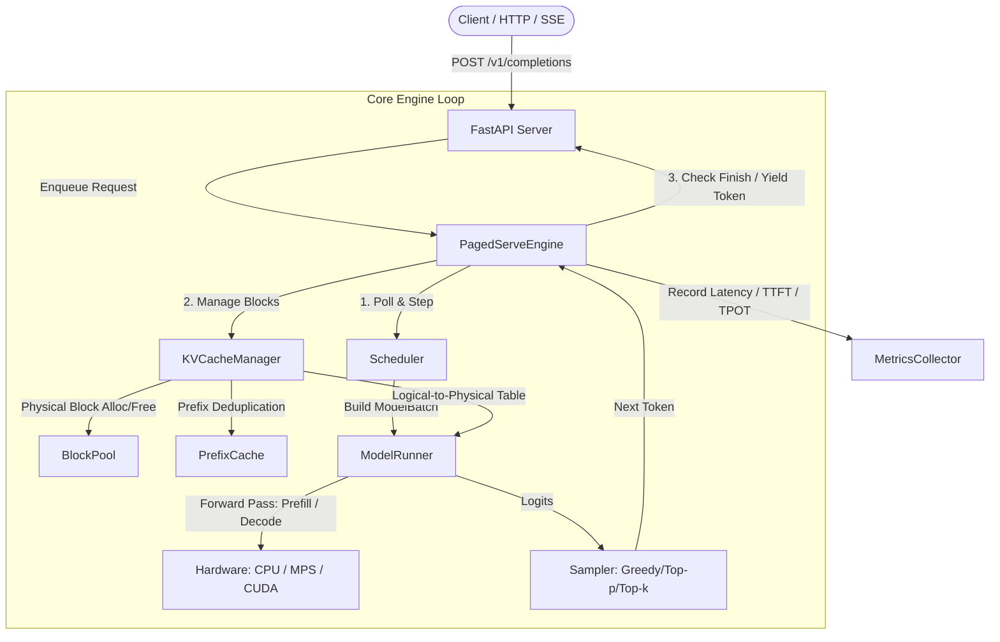

# PagedServe: Architecture & System Design

PagedServe is an experimental, from-scratch LLM (Large Language Model) inference runtime built to demonstrate deep systems understanding of memory management, request scheduling, continuous batching, and high-throughput model serving.

PagedServe is inspired by modern inference literature (specifically PagedAttention and vLLM), but is an independent, clean-room implementation designed for transparency, educational clarity, and rigorous benchmarking.

---

## 1. High-Level System Architecture

The following diagram illustrates the lifecycle of a request and the interactions between the server, inference engine, scheduler, memory subsystem, and model runner:

---

## 2. Subsystem Descriptions

### 2.1 Server & API Layer (`pagedserve/server/`)
- **FastAPI / Uvicorn**: Provides an asynchronous HTTP interface compatible with standard OpenAI-style endpoints (`/v1/completions`, `/v1/chat/completions`) as well as health (`/health`) and metrics (`/metrics`).
- **Streaming**: Server-Sent Events (SSE) streaming yielding token deltas incrementally.
- **Cancellation Detection**: Intercepts client disconnections via async iterators to immediately trigger engine cancellation and prevent resource leakage.

### 2.2 Inference Engine (`pagedserve/engine/`)
- **`PagedServeEngine`**: The orchestrator. Coordinates the scheduling loop, submits requests, drives model execution, runs the sampler, updates sequence states, handles prompt chunking, and guarantees that allocated physical blocks are freed when requests finish, fail, or cancel.
- **Request State Machine**:
  - `WAITING`: Request has arrived, queued in scheduler waiting queue.
  - `PREFILL`: Request is currently having prompt tokens computed and KV blocks populated.
  - `DECODING`: Prompt prefill complete; generating tokens iteratively one by one.
  - `FINISHED`: Sequence hit stop token or reached `max_new_tokens`.
  - `CANCELLED`: Client disconnected or caller explicitly cancelled request.
  - `FAILED`: Execution error or cache exhaustion that could not be recovered.

### 2.3 Scheduler & Continuous Batching (`pagedserve/scheduler/`)
- **Continuous Batching**: Unlike static batching which waits for all sequences in a batch to complete, continuous (iteration-level) batching dynamically admits new requests and retires completed requests at every single engine step.
- **Prefill vs. Decode Separation**:
  - Prefill processes many tokens in parallel, saturating compute.
  - Decode processes 1 token per sequence, bound by memory bandwidth.
- **Chunked Prefill**: Breaks large prompts (e.g. 2048 tokens) into configurable chunks (e.g. 512 tokens). This prevents long prompt prefill from starving active decode sequences, keeping Time-to-Next-Token (TPOT) stable.
- **Scheduling Policies**:
  - `FCFS`: First-Come, First-Served queue.
  - `MemoryAwareScheduler`: Original experimental policy that dynamically throttles prefill chunk size and prioritizes near-completion decode requests when KV memory pressure is high.

### 2.4 KV Memory Management (`pagedserve/memory/`)
- **Fixed-Size Block Allocation**: Memory is divided into fixed-size blocks (e.g., 16 tokens). Sequences allocate blocks on demand as they grow, eliminating external memory fragmentation.
- **`BlockPool`**: Manages physical block metadata (`block_id`, `ref_count`, `capacity`). Handles allocation, retaining, releasing, double-free prevention, and memory exhaustion detection.
- **`BlockTable` (Logical-to-Physical Mapping)**:
  - Logical block index $0 \to$ Physical block 17
  - Logical block index $1 \to$ Physical block 3
  - Non-contiguous physical memory is presented as a contiguous sequence of tokens.
- **`KVCacheManager`**: High-level interface handling initial prompt allocation, decode-time block expansion, sequence lifecycle cleanup, and block utilization statistics.
- **`PrefixCache`**: Content-addressed block caching using chained cryptographic hashes:
  $$\text{hash}_k = \text{SHA256}(\text{hash}_{k-1} \,\|\, \text{tokens in block } k)$$
  Shared prompt prefixes (system prompts, few-shot examples) share physical blocks, bumping reference counts without duplicating KV cache memory.

### 2.5 Model Runner & Sampling (`pagedserve/model/`)
- **`ModelLoader`**: Loads Hugging Face causal language models, auto-detecting device (`cuda`, `mps`, or `cpu`).
- **`ModelRunner`**: Executes prefill forwards and decode steps, assembling batch tensors, executing forward passes, retrieving logits, and managing internal cache states.
- **`Sampler`**: Provides temperature scaling, greedy decoding, Top-k filtering, and Top-p (nucleus) filtering.

### 2.6 Metrics & Telemetry (`pagedserve/metrics/`)
- Tracks:
  - Throughput (tokens/sec, requests/sec)
  - Latency metrics: Time to First Token (TTFT), Time Per Output Token (TPOT), End-to-End Latency.
  - Memory: BlockPool utilization, allocated blocks, free blocks, prefix cache hits.

---

## 3. Data Flow Walkthroughs

### 3.1 New Request Arrival
1. Client sends JSON payload to `POST /v1/completions`.
2. API validates schema, tokenizes prompt, builds `InferenceRequest` with unique `request_id`, status `WAITING`.
3. Engine enqueues request into scheduler waiting queue.

### 3.2 Prefill Step (Initial or Chunked)
1. Scheduler inspects free blocks in `BlockPool`.
2. If resources permit, request is admitted to `PREFILL`.
3. Prefix cache lookup: identical prefix blocks are reused; missing blocks are allocated from `BlockPool`.
4. Model runner runs forward pass on the prompt chunk.
5. If prompt is partially processed, request stays in `PREFILL` for subsequent chunk; if fully processed, state transitions to `DECODING`.

### 3.3 Decode Step
1. Each decode request consumes its latest token.
2. If sequence crosses a block boundary ($\text{num\_tokens} \pmod{\text{block\_size}} == 1$), `KVCacheManager` allocates a new physical block and appends it to request's `BlockTable`.
3. Model runner executes 1-token forward step for all batched decode sequences.
4. Logits sampled $\to$ next token generated.
5. If token matches stop token or sequence length reaches `max_new_tokens`, request transitions to `FINISHED`.

### 3.4 Request Completion / Cancellation / Failure
1. Engine detects `FINISHED`, `CANCELLED`, or `FAILED`.
2. All physical blocks mapped in request's `BlockTable` have their reference counts decremented via `KVCacheManager.release_request()`.
3. Blocks whose ref count reaches 0 return immediately to the `BlockPool` free list.
4. Prefix cache retains cached blocks until evicted under capacity pressure.
5. Final token sequence or error response returned to client.
